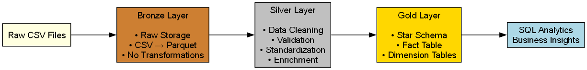
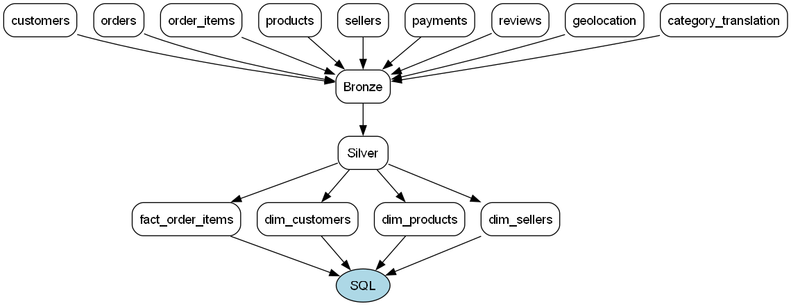
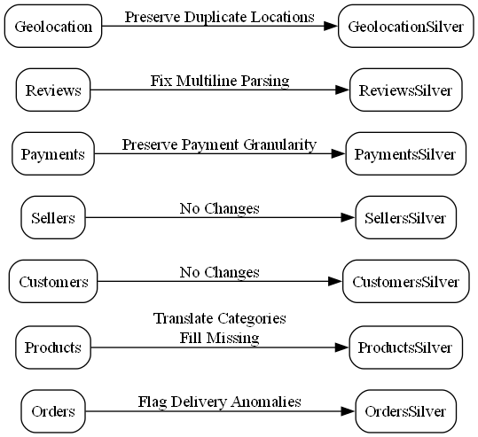
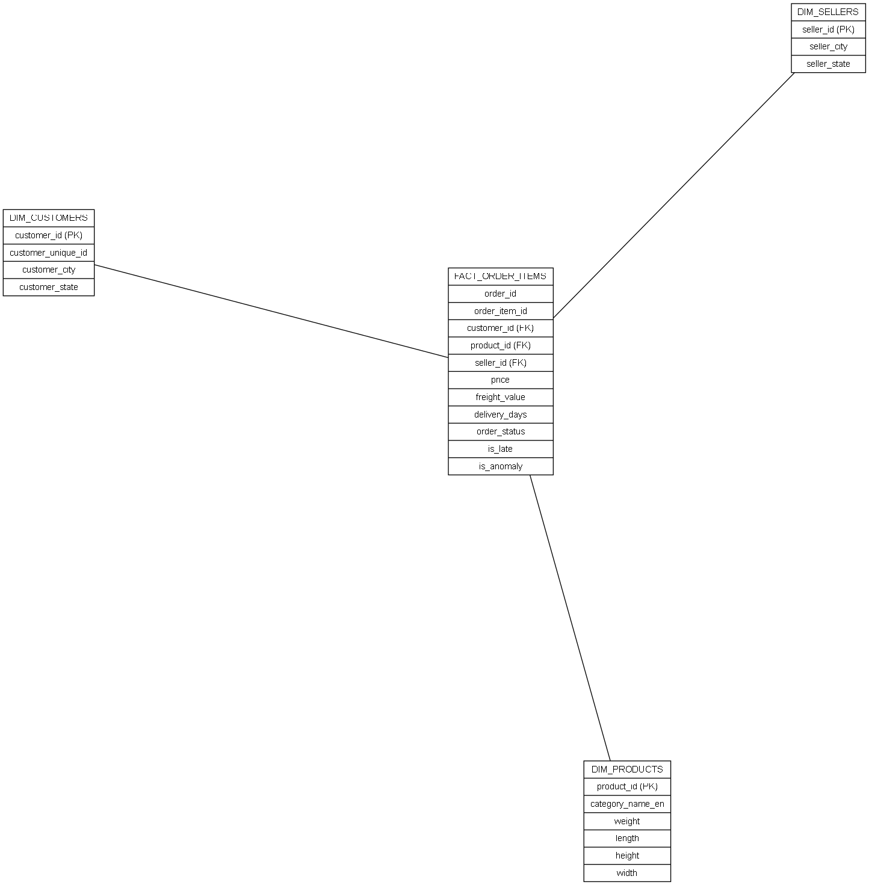
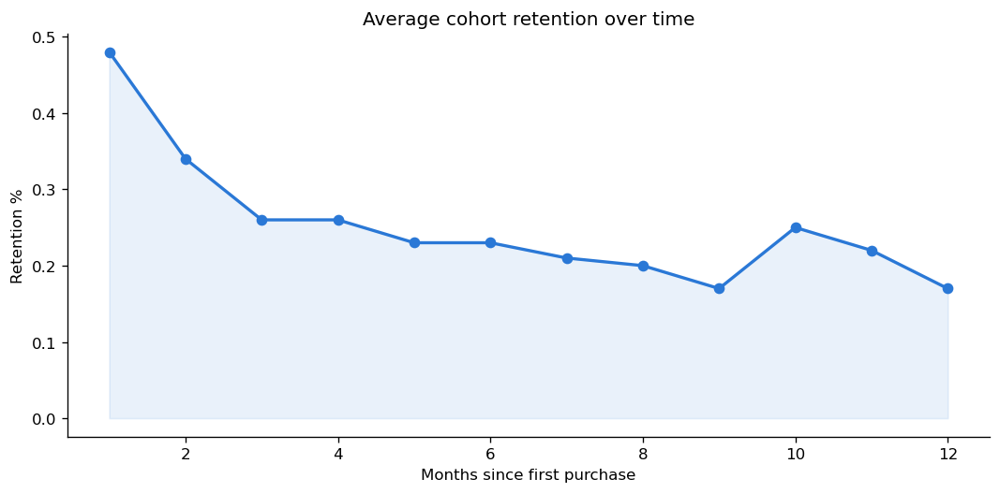
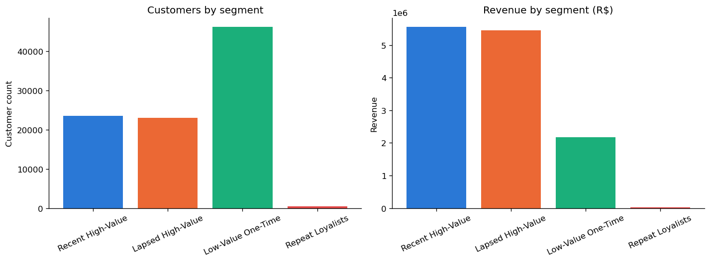
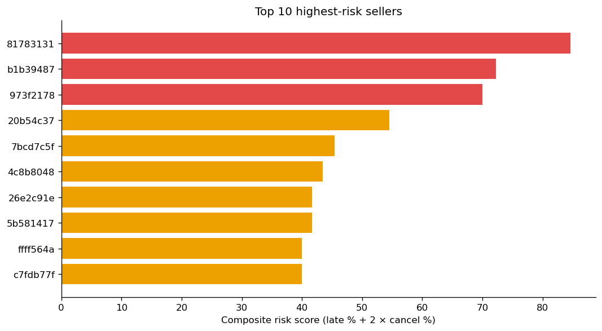

# Olist E-Commerce Data Warehouse & Business Analytics

## Project Overview

This project implements an end-to-end Data Warehouse and Business Analytics
workflow for the Olist Brazilian E-Commerce dataset using the Medallion
Architecture (Bronze → Silver → Gold).

The pipeline ingests raw transactional data, validates and cleans it using
PySpark, and transforms it into an analytics-ready Star Schema. The gold
layer is analyzed entirely in **Spark SQL** — customer segmentation, seller
risk scoring, and cohort retention — with pandas/matplotlib used only for
the final visualization step. Findings are packaged into an interactive
dashboard and a written business-recommendations report, including a
benchmark-backed opportunity-sizing analysis for one recommendation.

The project demonstrates modern Data Engineering and Business Analytics
concepts including:

- Data ingestion and profiling
- Data quality validation and standardization
- Dimensional modeling and star schema design
- Analytical SQL (Spark SQL, including window functions)
- Customer segmentation (RFM)
- Seller performance and risk scoring
- Cohort retention analysis
- Business dashboarding and benchmark-backed opportunity sizing

---

## Objectives

The primary objective of this project is to simulate a real-world Data
Engineering and Business Analytics workflow: build an analytical data
warehouse from raw transactional data, and use the resulting data to answer
concrete business questions.

The project focuses on:

- Preserving raw data integrity
- Improving data quality through validation and standardization
- Designing an efficient dimensional model
- Building analytics-ready datasets
- Supporting analytical SQL queries for business intelligence
- Identifying customer retention opportunities
- Evaluating seller operational performance
- Translating analytical findings into business recommendations

---

## Dataset

The project uses the **Olist Brazilian E-Commerce Dataset** — approximately
100K orders across 9 relational tables:

- Customers
- Orders
- Order Items
- Products
- Sellers
- Payments
- Reviews
- Geolocation
- Product Category Translation

---

## Technology Stack

| Technology | Purpose |
|------------|---------|
| Python | Data analysis and transformation |
| PySpark | Distributed data processing and ETL |
| Spark SQL | All gold-layer analytics (segmentation, risk, cohorts) |
| Pandas | Visualization data prep only (post-aggregation) |
| PostgreSQL | Relational database |
| Parquet | Columnar storage |
| HTML / Chart.js | Interactive business dashboard |
| Jupyter Notebook | Development and analysis |
| Git | Version control |

---

## Architecture

The project follows a layered data architecture that separates data
ingestion, transformation, modeling, and business analysis.



**Data flow across the pipeline:**



**Silver-layer transformation logic:**



**Gold-layer star schema:**



---

## Medallion Architecture

```text
Raw CSV
   ↓
Bronze
   ↓
Silver
   ↓
Gold
   ↓
Business Analytics (Spark SQL)
   ↓
Interactive Dashboard
```

Documentation:
- Bronze Layer → `docs/bronze.md`
- Silver Layer → `docs/silver.md`
- Gold Layer → `docs/gold.md`
- Business Insights → `docs/business-insights.md`

---

## Business Dashboard

An interactive dashboard summarizing the gold-layer analysis, including customer
segments, seller risk, cohort retention, lapse-reason segmentation, and win-back
opportunity sizing.

**Live Dashboard:** [View the live dashboard](https://pes2ug23cs194.github.io/ecommerce-de-project/dashboard.html)
---

## Key Findings

Full write-up with methodology, caveats, and validation plan: [`docs/business-insights.md`](docs/business-insights.md)

**1. Retention, not acquisition, is the constraint.**
97% of customers place exactly one order. Month-1 repeat purchase rate
across 20 monthly cohorts is 0.48%, declining to 0.17% by month 12.



**2. Revenue concentration is real but moderate.**



| Segment | Customers | % of customers | Revenue (R$) | % of revenue |
|---|---|---|---|---|
| Recent High-Value | 23,600 | 25.28% | 5,556,234.68 | 42.02% |
| Lapsed High-Value | 23,078 | 24.72% | 5,458,910.12 | 41.29% |
| Low-Value One-Time | 46,222 | 49.51% | 2,177,945.00 | 16.47% |
| Repeat Loyalists | 458 | 0.49% | 28,408.31 | 0.21% |

High-value segments (50.0% of customers) generate 83.3% of revenue.

**3. Seller risk is concentrated in a small group with high cancellation rates.**
Composite risk score weights cancellation rate 2x over late-delivery rate.
*Caveat: `order_status = 'canceled'` doesn't distinguish buyer- from
seller-initiated cancellations — treat the score as informative, not a
clean causal signal, until cancellation-initiator data is available.*



**4. Not all lapsed customers left for the same reason.**
Splitting Lapsed High-Value by whether their most recent order showed a
concrete negative signal (review score &le;2, late delivery, or cancellation):

| Bucket | Customers | % of segment | Revenue (R$) |
|---|---|---|---|
| No Detected Bad Experience | 19,273 | 83.51% | 4,463,614.96 |
| Bad Experience | 3,805 | 16.49% | 995,295.16 |

*"No Detected Bad Experience" means no measurable platform-side failure —
not that these customers are loyal or simply forgetful. The true reason
(competitor activity, changed needs, price sensitivity) can't be
distinguished from transaction data alone; recommended messaging below is
chosen specifically because it doesn't presume a cause.*

**5. Win-back opportunity sizing (Lapsed High-Value segment, overall):**

| Scenario | Reactivated customers | Incremental revenue (R$) | Lift |
|---|---|---|---|
| Conservative (12%, benchmark-sourced) | 2,769 | 654,979.26 | 12.0% |
| Optimistic (20%, benchmark-sourced) | 4,616 | 1,091,868.64 | 20.0% |

*This is a segment-wide projection sized against a published industry
benchmark, not a measured result — see `docs/business-insights.md` for how
to validate it, and for why messaging (not the projected rate) should
differ between the two buckets above.*

**Recommendations:**
- Split win-back messaging by bucket: value-led reminder, no discount, for
  the 19,273 customers with no detected issue; acknowledgment followed by
  a real incentive for the 3,805 with a detected one.
- Flag sellers with `composite_risk_score > 70` for manual account review,
  pending the cancellation-attribution caveat above.

---

## Key Features

- End-to-End ETL/ELT Pipeline
- Bronze, Silver and Gold Layers
- Data Profiling, Validation, and Standardization
- Star Schema Design
- RFM Customer Segmentation (Spark SQL window functions)
- Seller Risk Scorecarding
- Cohort Retention Analysis
- Lapse-Reason Segmentation
- Benchmark-Backed Opportunity Sizing
- Interactive Business Dashboard

---

## Project Structure

```text
project/

├── data/
├── bronze/
├── silver/
├── gold/

├── notebooks/
│   ├── 01_bronze_layer.ipynb
│   ├── 02_silver_layer.ipynb
│   ├── 03_gold_layer.ipynb
│   ├── final_analytics.ipynb         (Spark SQL marts + charts + win-back projection)
│   └── analytics_exports/
│       ├── cohort_retention.csv
│       ├── customer_segmentation.csv
│       ├── seller_scorecard.csv
│       └── dashboard/
│           ├── segment_summary.csv
│           ├── top_seller_risk.csv
│           ├── cohort_summary.csv
│           ├── winback_projection.csv
│           ├── lapse_reason_buckets.csv
│           └── charts/
│               ├── segment_summary.png
│               ├── seller_risk.png
│               ├── cohort_retention.png
│               └── lapse_reason_buckets.png

├── dashboard.html

├── docs/
│   ├── bronze.md
│   ├── silver.md
│   ├── gold.md
│   └── business-insights.md

├── diagrams/
│   ├── architecture.png
│   ├── data_flow.png
│   ├── silver_transformation.png
│   ├── star_schema.png
│   └── dashboard_preview.png

└── README.md
```

---

## Future Improvements

- Incremental Data Loading
- Schema Evolution
- Delta Lake
- Apache Airflow orchestration
- Cloud Deployment
- Treatment/control A/B test to validate the win-back and lapse-reason
  messaging split with real data
- Predictive model for customer churn / repeat-purchase likelihood
